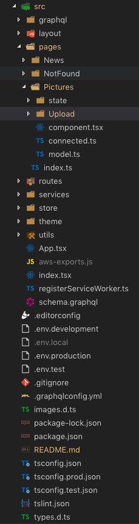
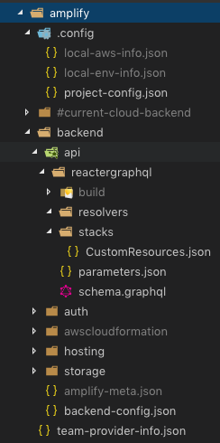

# Reacter

Just a simple Cloud-Powered React App Starter.

The goal is to use only a basic set of all the TypeScript practices, The Almighty React, **AWS Amplify**, and **AppSync** together for user login and authorization when making GraphQL queries and mutations.

## Frontend

## Backend

